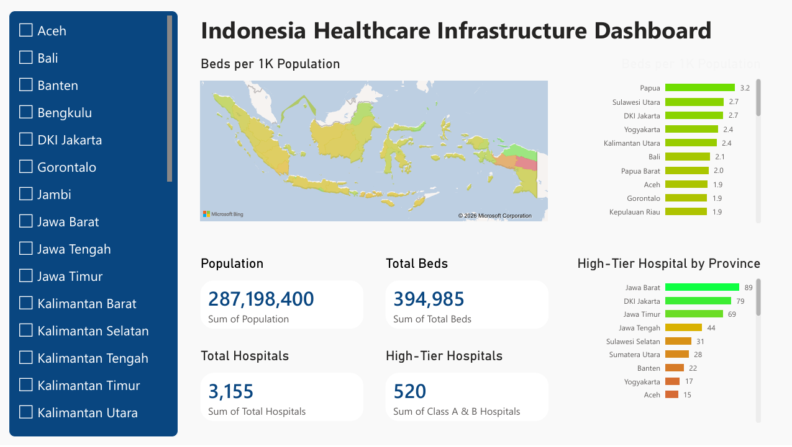

# 🏥 Indonesia Healthcare Infrastructure Analysis

A data analytics project that evaluates healthcare infrastructure across Indonesian provinces by integrating hospital and population datasets. The project focuses on measuring healthcare accessibility using standardized indicators and presents the findings through an interactive Power BI dashboard.

---

## 📌 Project Overview

This project analyzes the distribution of healthcare infrastructure in Indonesia by combining hospital and population data. Several healthcare indicators are calculated to enable fair comparisons across provinces, including total hospital per province, hospital beds per 1,000 population, and total high-tier hospital per province.

The analysis aims to identify regional disparities in healthcare infrastructure and evaluate whether provinces have adequate healthcare capacity relative to their population.

---

## 🎯 Objectives

- Clean and prepare multiple healthcare datasets.
- Standardize province-level information for data integration.
- Calculate healthcare infrastructure indicators.
- Build an interactive Power BI dashboard.
- Identify provinces with limited healthcare accessibility.
- Present insights through a business-style analytical report.

---

## 📂 Dataset

The project combines two public datasets:

- Indonesia Hospitals Dataset
- Indonesia Population Dataset (2026)

After cleaning and preprocessing, both datasets were merged using the **Province** column as the shared key.

---

## 🛠️ Technologies Used

- Python
- Pandas
- DuckDB SQL
- Power BI
- Microsoft Excel
- Microsoft PowerPoint

---

## 🔄 Methodology

This project follows the **CRISP-DM (Cross-Industry Standard Process for Data Mining)** framework:

1. Problem Statement
2. Data Understanding
3. Data Preparation
4. Data Visualization
5. Data Evaluation

---

## 📐 Key Healthcare Indicators

The following indicators were created during feature engineering:

- Total Hospitals
- High-Tier Hospitals (Class A & B)
- Total Beds
- Total Healthcare Workers
- Hospitals per 100,000 Population
- Beds per 1,000 Population
- Healthcare Workers per 1,000 Population
- Beds per Hospital
- Healthcare Workers per Bed

---

## 💡 Key Findings

- Most provinces meet or exceed **1 hospital bed per 1,000 population**, indicating relatively adequate basic bed availability.
- Access to high-tier hospitals remains concentrated in **Jawa Barat, DKI Jakarta, and Jawa Timur**.
- Several eastern provinces have very limited or no Class A and Class B hospitals, suggesting unequal access to advanced healthcare services.
- The analysis highlights regional disparities in healthcare infrastructure despite generally sufficient bed availability.

---

## 🖥️ Dashboard Preview

Interactive dashboard developed in Power BI.



---

## 📁 Repository Structure

```text
indonesia-healthcare-infrastructure-analysis/
│
├── Indonesia Healthcare Infrastructure Analysis.pdf(Indonesia Healthcare Infrastructure Analysis.pdf)
├── Indonesia Healthcare Infrastructure Dashboard.pdf
│
├── 📂 data/
│   ├── indonesia_healthcare_infrastructure_analysis.pptx
│   ├── indonesia_healthcare_infrastructure_dashboard.pbix
│   ├── indonesia_healthcare_infrastructure_dashboard.png
│   ├── data_understanding_and_preparation.ipynb
│   ├── hospital_population_cleaned.csv
│   ├── province_summary.xlsx
│   └── 📂 dataset/
│        ├── indonesia_hospitals.csv
│        └── indonesia_population_2026.csv
│
└── 📄 README.md
```

---

## 👤 Author

**Rangga**

*Data Analytics Portfolio Project*
